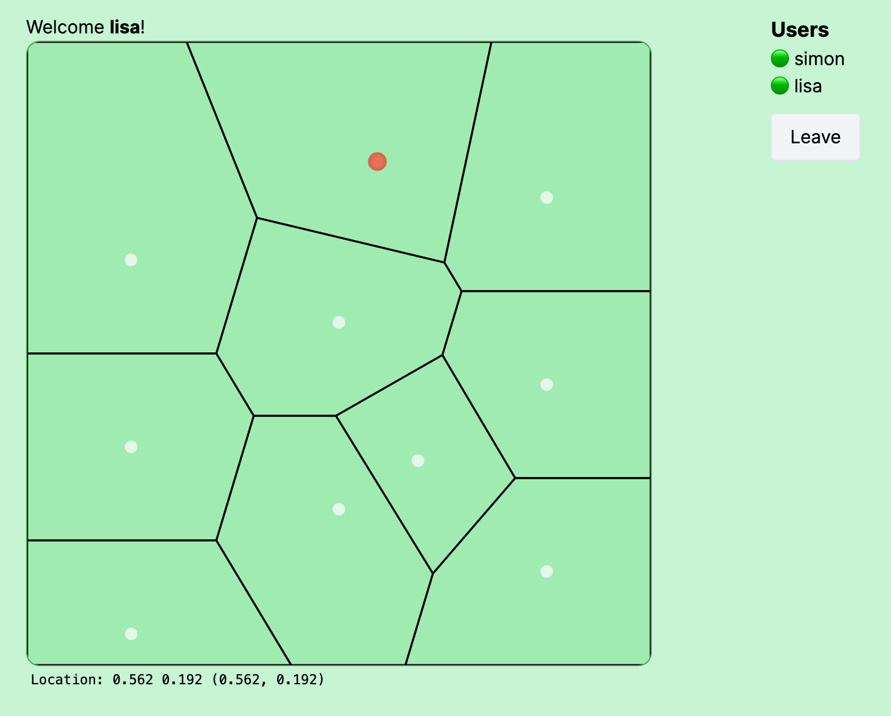

# Voromulti
In this interactive experience a [Voronoi diagram](https://en.wikipedia.org/wiki/Voronoi_diagram) is displayed where each site is controlled by one of the connected users.

> Created by [Simon Karman](https://www.simonkarman.nl) implemented using [Krmx](https://simonkarman.github.io/krmx) and [D3](https://github.com/d3/d3-delaunay).



## Modules
- **[server](./server)** - The NodeJS application containing the server-side logic
- **[client](./client)** - The React web application contain the ui and client-side logic

## Getting Started
In the server directory run:
```bash
npm install
npm run dev
```

Keep the server process running and then, in the client directory run:
```bash
npm install
npm run dev
# open the application on localhost:3000
```

## Implementation
This application allows multiple users to interact with the Voronoi diagram in real-time. Each user's mouse location controls a site on the diagram, creating a unique and dynamic visual experience.

The application is built with a NodeJS server handling the backend and a React frontend for the user interface. It uses the [Krmx](https://simonkarman.github.io/krmx) library for the websocket based networking and [D3](https://github.com/d3/d3-delaunay) for Voronoi diagram generation.
